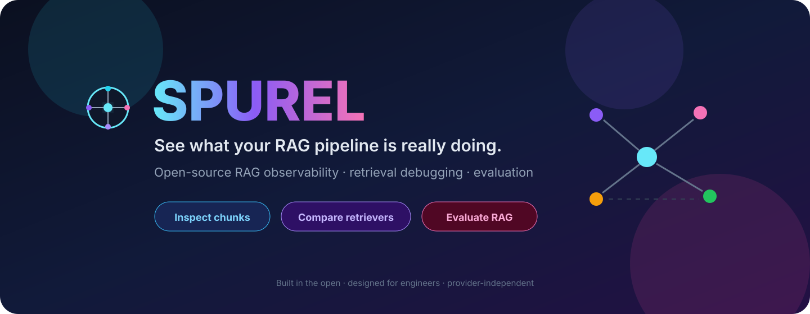
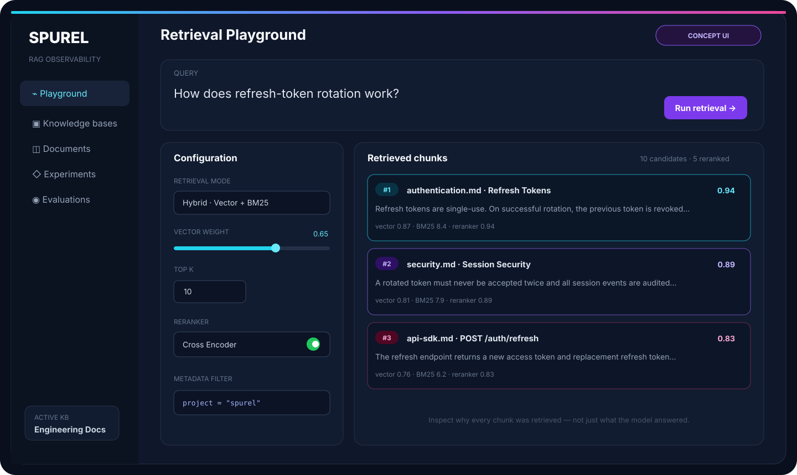
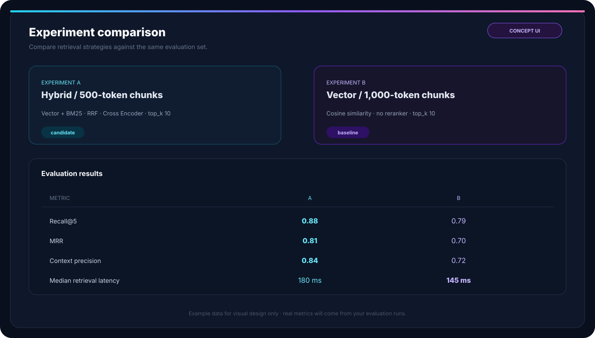
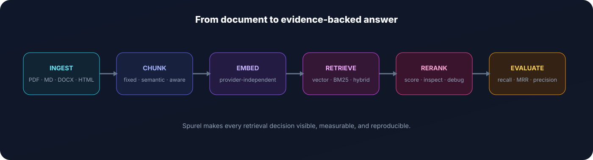

<p align="center">
  
</p>

<p align="center">
  <strong>Open-source observability, debugging, experimentation, and evaluation for RAG systems.</strong>
</p>

<p align="center">
  
  
  
  
</p>

<p align="center">
  <a href="#-why-spurel">Why Spurel</a> ·
  <a href="#-planned-features">Features</a> ·
  <a href="#-concept-ui">Concept UI</a> ·
  <a href="#-architecture">Architecture</a> ·
  <a href="#-roadmap">Roadmap</a> ·
  <a href="#-contributing">Contributing</a>
</p>

> [!IMPORTANT]
> **Spurel is currently in early-stage design / pre-alpha.**  
> The screenshots below are product concept mockups, not screenshots of a finished implementation. The repository is being built in public.

## ✨ What is Spurel?

**Spurel** is an open-source RAG engineering workbench for developers who want to understand **why** a retrieval pipeline succeeds or fails.

Most RAG demos stop here:

```text
Question → Retrieve chunks → LLM → Answer
```

Spurel focuses on everything that happens in the middle:

```text
What was retrieved?
Why did it rank?
Which chunking strategy worked better?
Did hybrid search improve recall?
Did reranking help?
Which queries consistently fail?
What changed between experiment A and B?
```

> **Make RAG retrieval visible, measurable, reproducible, and easier to improve.**

## 🎯 Why Spurel?

| Problem | What Spurel helps you inspect |
|---|---|
| 🧩 Bad chunking | Boundaries, token counts, overlap, lost context |
| 🔎 Weak retrieval | Retrieved candidates, similarity scores, missed evidence |
| ⚖️ Poor ranking | Vector vs. keyword vs. reranker scores |
| 🧠 Wrong context | What was actually passed to the LLM |
| 🧪 No measurement | Recall@K, MRR, hit rate, context precision |
| 🔁 Hard-to-reproduce tuning | Saved experiments and configuration snapshots |
| 🕵️ Silent regressions | Evaluation runs across versions |

## 🚀 Planned features

### 🔍 Retrieval Playground
- Vector search
- BM25 / keyword retrieval
- Hybrid retrieval
- Reciprocal Rank Fusion
- Metadata filters
- Configurable `top_k`
- Reranking
- Per-stage scores
- Candidate → final-rank trace

### 🧩 Chunk Inspector
- Fixed-size chunking
- Recursive chunking
- Markdown / heading-aware chunking
- Sentence-aware chunking
- Semantic chunking
- Token counts
- Overlap visualization
- Metadata preview

### 🧪 Experiment Comparison

```text
Experiment A                       Experiment B
────────────────────────          ────────────────────────
500-token chunks                  1,000-token chunks
Hybrid retrieval                  Vector-only retrieval
RRF                               No fusion
Cross-encoder reranker            No reranker
top_k = 10                        top_k = 10
```

### 📊 Evaluation
- Recall@K
- Precision@K
- Hit Rate
- Mean Reciprocal Rank (MRR)
- NDCG
- Context precision
- Context recall
- Retrieval latency

### 📚 Knowledge Bases
- Documents
- Chunks
- Embeddings
- Metadata
- Ingestion runs
- Retrieval configurations
- Evaluation datasets

### 🔌 Provider-independent design

**Embeddings:** `OpenAI` · `Cohere` · `Voyage` · `SentenceTransformers` · `Ollama`

**LLMs:** `OpenAI` · `Anthropic` · `Gemini` · `Ollama` · `OpenRouter`

Spurel starts with **PostgreSQL + pgvector** for vector storage.

## 🖥️ Concept UI

### Retrieval Playground

<p align="center">
  
</p>

Inspect why chunks were retrieved, how they scored, what reranking changed, and what evidence reached generation.

### Experiment Comparison

<p align="center">
  
</p>

> Mockup values are illustrative only. Real experiment metrics will come from evaluation runs.

## 🏗️ Architecture

<p align="center">
  
</p>

```text
                    ┌──────────────────────┐
                    │       Next.js        │
                    │    Debugging UI      │
                    └──────────┬───────────┘
                               │
                               ▼
                    ┌──────────────────────┐
                    │       FastAPI        │
                    │      REST API        │
                    └──────────┬───────────┘
                               │
          ┌────────────────────┼────────────────────┐
          │                    │                    │
          ▼                    ▼                    ▼
 ┌────────────────┐   ┌────────────────┐   ┌────────────────┐
 │   Ingestion    │   │   Retrieval    │   │   Evaluation   │
 │ parse          │   │ vector         │   │ datasets       │
 │ normalize      │   │ BM25           │   │ metrics        │
 │ chunk          │   │ hybrid         │   │ experiments    │
 │ embed          │   │ rerank         │   │ comparisons    │
 └───────┬────────┘   └───────┬────────┘   └───────┬────────┘
         └────────────────────┼────────────────────┘
                              ▼
                    ┌──────────────────────┐
                    │ PostgreSQL + pgvector│
                    └──────────────────────┘
```

## 🧰 Planned stack

| Layer | Technology |
|---|---|
| Frontend | Next.js + TypeScript |
| Backend | Python 3.13 + FastAPI |
| Validation | Pydantic v2 |
| ORM | SQLAlchemy 2 |
| Migrations | Alembic |
| Database | PostgreSQL |
| Vector search | pgvector |
| Cache / jobs | Redis |
| Containers | Docker / Docker Compose |
| Testing | Pytest |
| CI | GitHub Actions |

## 🧠 Core domain

```text
Workspace
  ├── Knowledge Base
  │     ├── Documents
  │     ├── Chunks
  │     ├── Embeddings
  │     └── Ingestion Runs
  ├── Retrieval Configuration
  │     ├── Retriever
  │     ├── Fusion
  │     ├── Reranker
  │     └── Filters
  ├── Evaluation Dataset
  │     ├── Questions
  │     └── Expected Evidence
  └── Experiment
        ├── Configuration Snapshot
        ├── Retrieval Traces
        └── Metrics
```

## 🛣️ Roadmap

### Phase 0 — Foundation
- [ ] Repository structure
- [ ] Backend + frontend applications
- [ ] PostgreSQL + pgvector
- [ ] Docker Compose
- [ ] CI
- [ ] Configuration and environment management

### Phase 1 — Ingestion
- [ ] Knowledge bases
- [ ] PDF / Markdown / text ingestion
- [ ] Chunking pipeline
- [ ] Embeddings
- [ ] Chunk Inspector
- [ ] Metadata

### Phase 2 — Retrieval
- [ ] Vector search
- [ ] Keyword / BM25 retrieval
- [ ] Hybrid retrieval
- [ ] Metadata filtering
- [ ] Retrieval Playground
- [ ] Retrieval traces

### Phase 3 — Reranking
- [ ] Reranker interface
- [ ] Cross-encoder reranking
- [ ] Ranking comparison
- [ ] Per-stage score visualization

### Phase 4 — Evaluation
- [ ] Evaluation datasets
- [ ] Recall@K
- [ ] Precision@K
- [ ] Hit rate
- [ ] MRR
- [ ] NDCG
- [ ] Experiment runs
- [ ] Side-by-side comparison

### Phase 5 — Open-source extensibility
- [ ] Embedding provider adapters
- [ ] LLM provider adapters
- [ ] Pluggable retrieval strategies
- [ ] Exportable experiment results
- [ ] Public extension documentation

## 🧭 What Spurel is not

Spurel is intentionally **not**:
- a general-purpose AI agent platform
- an MCP client
- a workflow automation engine
- a generic ChatGPT clone
- another basic “chat with your PDF” demo

Spurel is about **retrieval engineering**.

## 🤝 Contributing

Spurel is being built in public. Contributions will be welcome as the foundation lands.

Good contribution areas:
- chunking strategies
- retriever adapters
- rerankers
- evaluation metrics
- parsers
- visualization improvements
- documentation
- reproducible RAG benchmarks

Before a large change, please open an issue describing the proposal so the design can stay coherent.

## 🌱 Project philosophy

1. **Retrieval first** — optimize evidence before generation.
2. **Inspectable by default** — important decisions should be visible.
3. **Measure before tuning** — improvements need evaluation.
4. **Provider-independent boundaries** — infrastructure should be replaceable.
5. **Reproducible experiments** — configurations and results should be traceable.
6. **Simple before clever** — add complexity only when it solves a demonstrated problem.
7. **Open by design** — useful primitives should be reusable outside the UI.

<p align="center">
  <strong>Spurel</strong><br/>
  <sub>See what your RAG pipeline is really doing.</sub>
</p>

<p align="center">
  ⭐ Star the repository if you want to follow the build.
</p>
